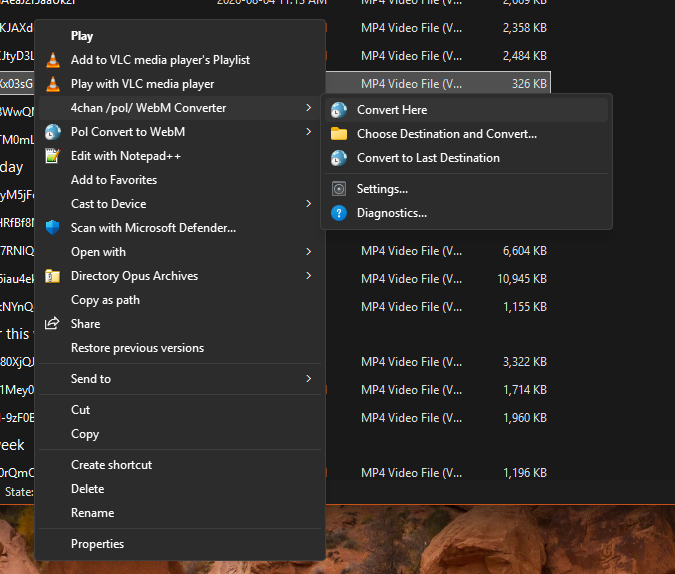
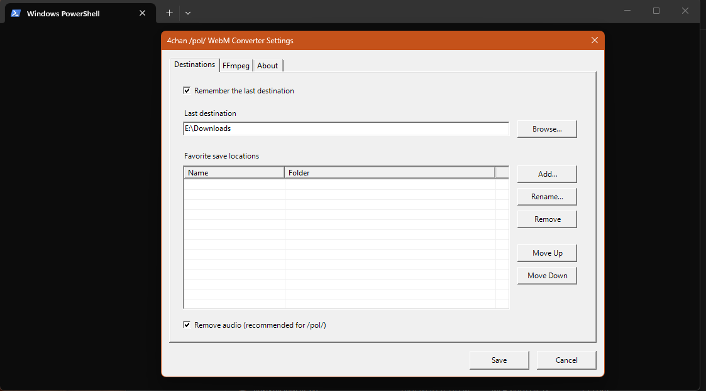
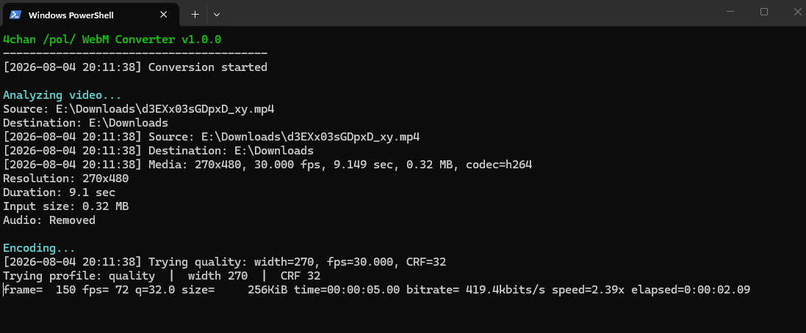

# 4chan /pol/ WebM Converter

Convert videos into 4chan /pol/-compatible VP9 WebM files directly from the Windows Explorer context menu.

## Settings

## Conversion

A Windows utility that converts videos into `/pol/`-compatible WebM files.

## Quick Start

1. Download the latest release.
2. Run `Install.bat`.
3. Put `ffmpeg.exe` and `ffprobe.exe` beside the application (or install FFmpeg).
4. Right-click a video.
5. Select **4chan /pol/ WebM Converter**.

## Limits

- WebM output
- VP9 video
- Audio removed by default
- Optional Opus audio preservation
- Maximum 4 MB
- Maximum 120 seconds per output
- Videos up to 15 seconds over the limit are sped up to fit
- Longer videos are split into multiple parts

## Explorer menu

Right-click a video and choose **4chan /pol/ WebM Converter**:

- Convert Here
- Choose Destination and Convert...
- Convert to Last Destination
- Favorite save locations
- Settings...

## Installation

1. Extract the ZIP.
2. Run `Install.bat`.
3. Put `ffmpeg.exe` and `ffprobe.exe` in the installed `app` folder, or install FFmpeg in PATH.
4. Right-click a video.

## Settings and favorites

Open **Settings...** from the context menu to:

- remember the last destination
- choose a default last destination
- add up to five favorite save folders
- remove favorites

Settings are stored locally in `%LOCALAPPDATA%\4chan-pol-webm-converter`.

## Privacy

No telemetry or analytics. Files are processed locally.

## Existing personal installations

The public installer uses `4chanPolWebm` and does not modify older personal menus that use other registry key names.

## FFmpeg detection

The converter checks:

- paths selected in Settings
- the application folder
- common FFmpeg installation folders
- Scoop and Chocolatey locations
- the system PATH

Use **Diagnostics...** from the Explorer submenu to generate a local report.

## Settings utilities

The Settings window includes:

- FFmpeg and FFprobe status
- Open Application Folder
- Open Logs
- Rebuild Context Menu
- Named favorite destinations
- Favorite reordering

## Upgrade behavior

Running `Install.bat` over an existing public installation replaces application files while preserving settings and logs.

## Console output

The converter shows concise analysis, encoding, and completion stages. Detailed technical information remains available in the log files.

## Audio

Audio removal is enabled by default for `/pol/`.

To preserve audio, open **Settings...** and clear **Remove audio (recommended for /pol/)**. Preserved audio is encoded as Opus at 64 kbps and still counts toward the 4 MB output limit.
